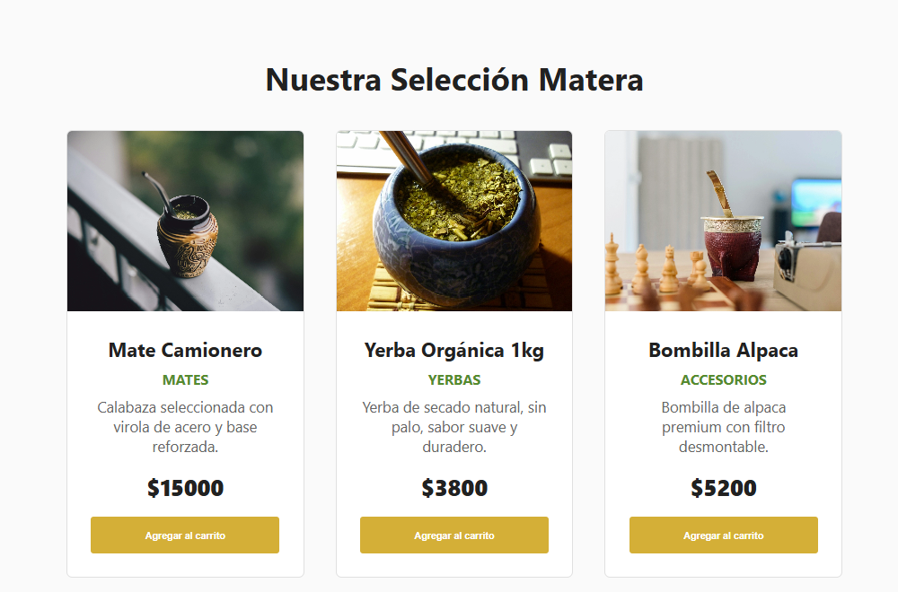

# Mundo Mate

Proyecto desarrollado para el Trabajo Práctico 1 de la materia Frontend. 
El objetivo fue presentar la estructura, estilos y fuentes de una tienda, adaptándola a una nueva temática: **la cultura matera**.

Este proyecto refuerza habilidades en maquetación web, uso de Flexbox, diseño responsivo, manejo de Git/GitHub y trabajo colaborativo.

## Vista Previa

Aquí puedes observar la interfaz principal y la sección de productos del sitio:




## Características del Proyecto

* **Diseño Responsivo:** Adaptado a 4 tamaños de pantalla (Desktop, Tablet horizontal/vertical, Mobile 1 y 2).
* **Maquetación:** Uso intensivo de `Flexbox` y `CSS Grid / Flexbox` para el posicionamiento de elementos.
* **Buenas Prácticas:**
    * Código limpio, indentado y documentado.
    * Estructura basada en componentes reutilizables.
    * Manejo de Box Model y unidades relativas (`%`, `vw`, `rem`).
    * Optimización de imágenes (WebP, <500kb).

## Tecnologías Utilizadas

* **React + Vite:** Framework y entorno de desarrollo.
* **CSS Puro:** Estilos modulares utilizando unidades relativas.
* **Git:** Control de versiones colaborativo.

## Estructura del Proyecto

```text
trabajo-practico-01-frontend/
├── public/           # Archivos estáticos públicos
├── src/
│   ├── assets/       # Imágenes optimizadas y fuentes
│   ├── components/   # Componentes reutilizables (Navbar, Footer, ProductCard, etc.)
│   ├── data/         # Archivos de datos centralizados (productos.ts, etc.)
│   ├── helpers/      # Funciones de utilidad
│   ├── hooks/        # Hooks personalizados
│   ├── pages/        # Componentes de página (Home, Productos, Contacto, etc.)
│   ├── readme/       # Imágenes de muestra para el README
│   ├── styles/       # Hojas de estilo globales y modulares
│   ├── App.tsx       # Componente raíz
│   └── main.tsx      # Punto de entrada de la aplicación
├── index.html        # Archivo HTML base
└── README.md         # Documentación del proyecto